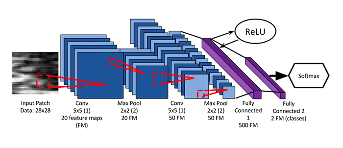

## Diving into pytorch
**_Definition_**: framework that provides 2 main features:

- Tensor with GPU acceleration.
- Deep neural network built on a tape based autograd system.

---
##### Components of torch:

- [torch](#torch) (<i>tensor library</i>)
- [torch.autograd](#torch.autograd) (<i>differentiation library which supports all tensor diff functions.</i>)
- [torch.jit](#torch.jit) (<i>compilation stack</i>)
- [torch.nn](#torch.nn) (<i>neural network library integrated with autograd</i>)
- [torch.multiprocessing](#torch.multiprocessing) (<i>python multiprocessing</i>)
- [torch.utils](#torch.utils) (<i>DataLoader and other features.</i>)

---

##### Starting with torch: {#torch}
##### Autograd: {#torch.autograd}
##### JIT: {#torch.jit}
##### Neural Network: {#torch.nn}
##### Torch Utility: {#torch.utils}

---

#### Neural Network:

###### learning rate:
###### learning rate scheduler:
###### backward pass:
###### zero grad:
###### optimizer:
###### batch norm:

---

#### Convolutional Neural Networks:

---